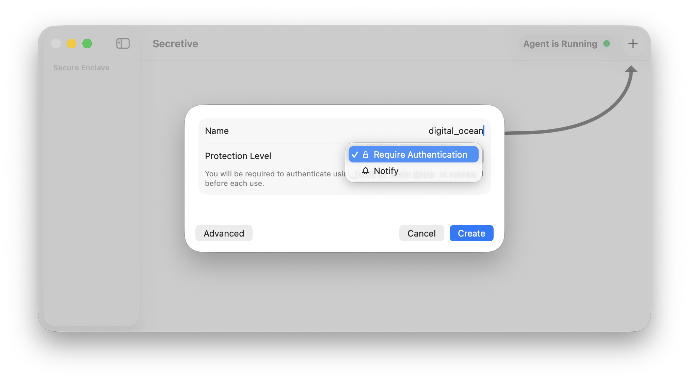
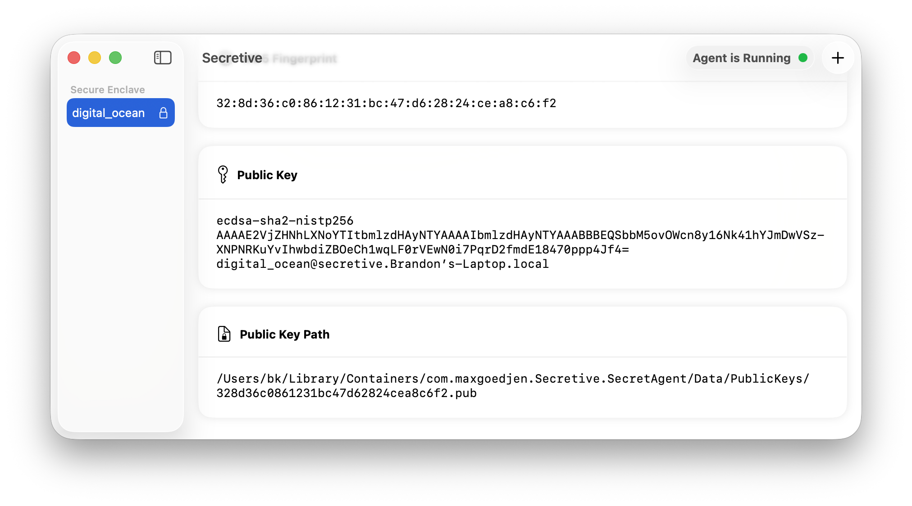
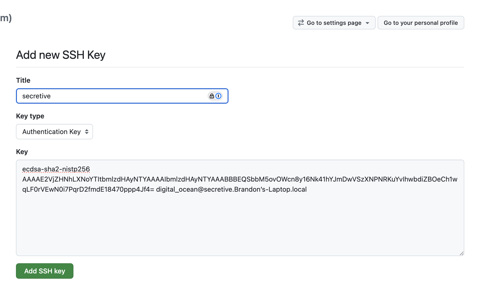
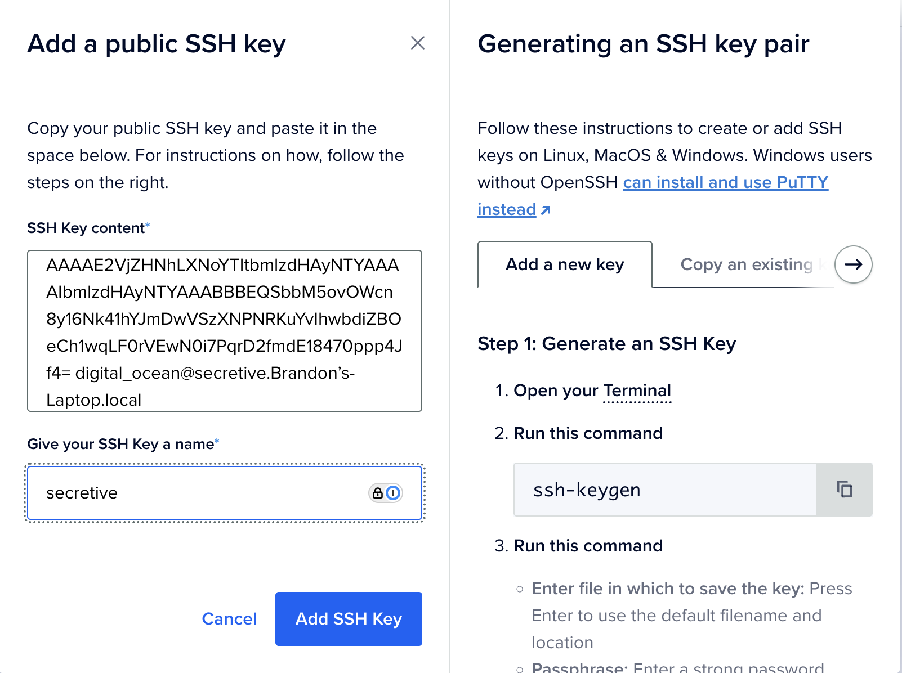
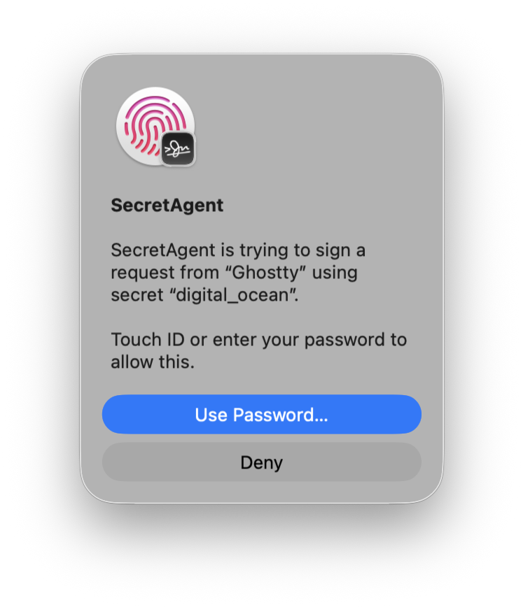
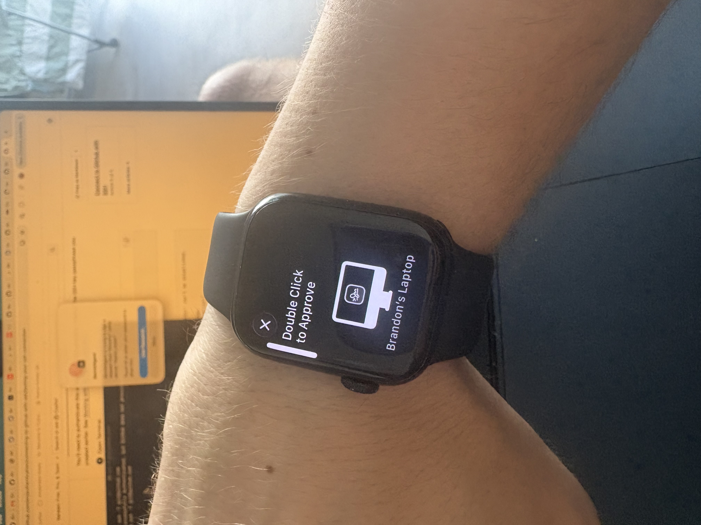

# What is Secretive?

[Secretive](https://github.com/maxgoedjen/secretive) is an open-source macOS app for protecting and managing SSH keys with the Secure Enclave.

# How do I set it up?

1. Download the app from [https://github.com/maxgoedjen/secretive/releases](https://github.com/maxgoedjen/secretive/releases) and drag it to your Applications folder.
1. Launch the app and create an ssh key. You can choose to require TouchID each time the key is used or simply be notified when the key is used

    

1. Set up `SSH_AUTH_SOCK` in your zshrc or bashrc to point to Secretive's agent.

    ```shell
    % cat ~/.zshrc
    export SSH_AUTH_SOCK=/Users/bk/Library/Containers/com.maxgoedjen.Secretive.SecretAgent/Data/socket.ssh
    ```

1. Refresh your shell config: `source ~/.zshrc`
1. Grab public ssh key from Secretive.

    

1. Upload your public key to whatever service you are interested in authenticating to, such as Github or Digital Ocean.

    

    

1. Try to use your ssh key. For example, if you uploaded your key to Github for auth, you can test your connection to Github: `ssh -T git@github.com`.

    Secretive's SecretAgent should prompt you for TouchID in order to access the private key.

    

    If you have an Apple Watch, you can even approve the access from your watch!

    

1. In the case of Github, if your authentication was successful you will see this:

    ```
    Hi discentem! You've successfully authenticated, but GitHub does not provide shell access.
    ```
