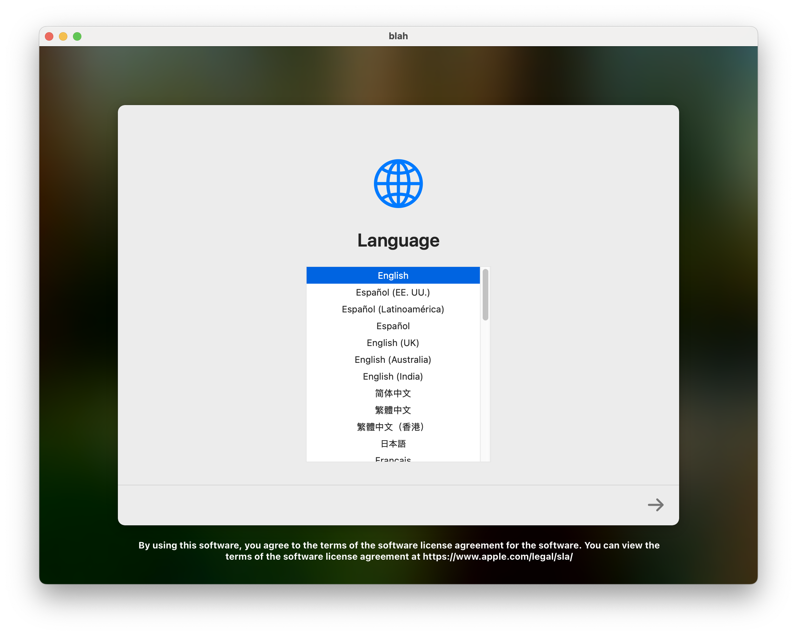
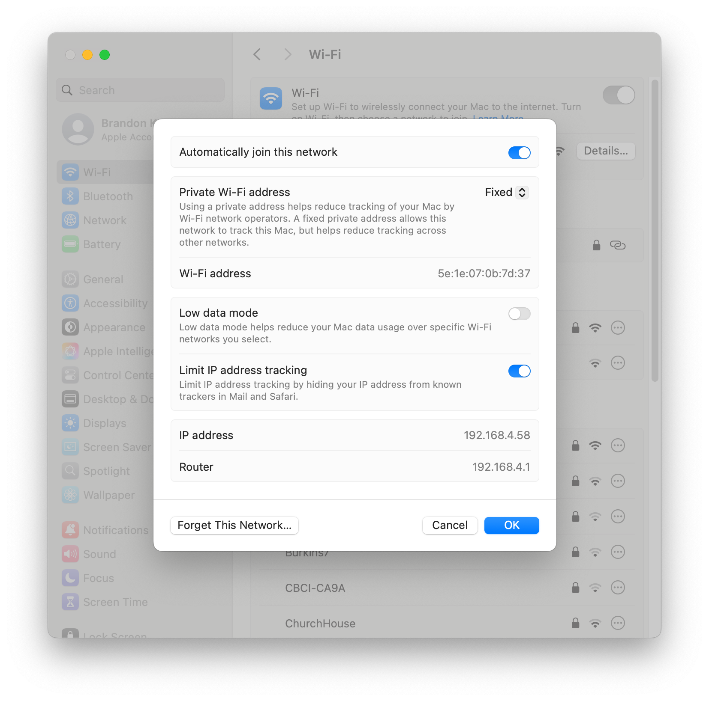

This post documents how to set up a macOS virtual machine with Tart. 
# Installing Tart

<details>
  <summary style="padding-left: 1.5em"><span style="font-size: 1.2em; font-weight: bold;">Option 1: Install Tart via Homebrew</span></summary>

<details>
  <summary style="padding-left: 1.5em"><span style="font-size: 0.9em; font-weight: bold">If you don't already have Homebrew installed</span></summary>

1. Navigate to [http://brew.sh/](http://brew.sh/).

1. Copy and execute the install command shown on the Homebrew website in Terminal:

    <div style="
    background-color: #1a1b20;
    color: #e6e6e6;
    font-family: SFMono-Regular, Consolas, 'Liberation Mono', Menlo, monospace;
    font-size: 0.9em;
    padding: 0.75em 1em;
    border-radius: 6px;
    white-space: pre-wrap;
    word-break: break-word;
    line-height: 1.5;
    ">/bin/bash -c "$(curl -fsSL https://raw.githubusercontent.com/Homebrew/install/HEAD/install.sh)"</div>

   > ⚠️ **Caution**: Be careful about executing shell scripts directly from the internet. 
   
  </details>
    
Once brew is installed, install Tart

```
brew install cirruslabs/cli/tart
```

</details>

<details>
<summary style="padding-left: 1.5em"><span style="font-size: 1.2em; font-weight: bold;">Option 2: Install Tart directly from Github</span></summary>

1. Download Tart. As of mid-July 2025, 2.28.2 is the latest release:

    <br />
    <div style="
    background-color: #1a1b20;
    color: #e6e6e6;
    font-family: SFMono-Regular, Consolas, 'Liberation Mono', Menlo, monospace;
    font-size: 0.9em;
    padding: 0.75em 1em;
    border-radius: 6px;
    white-space: pre-wrap;
    word-break: break-word;
    line-height: 1.5;
    ">curl https://github.com/cirruslabs/tart/releases/download/2.28.2/tart.tar.gz -Lo tart.tar.gz</div>

    > `-L` will allow `curl` to follow redirects and `o` specifies what you want to name the downloaded file and where you want to save it.

    <br />

1. Extract Tart to `/Applications`:

    <br />
    <div style="
    background-color: #1a1b20;
    color: #e6e6e6;
    font-family: SFMono-Regular, Consolas, 'Liberation Mono', Menlo, monospace;
    font-size: 0.9em;
    padding: 0.75em 1em;
    border-radius: 6px;
    white-space: pre-wrap;
    word-break: break-word;
    line-height: 1.5;
    ">tar -xzf tart.tar.gz -C /Applications</div>

    <br />

1. Create an alis for Tart, so that you can simply type `tart` in terminal to access it.

    <div style="
        background-color: #1a1b20;
        color: #e6e6e6;
        font-family: SFMono-Regular, Consolas, 'Liberation Mono', Menlo, monospace;
        font-size: 0.9em;
        padding: 0.75em 1em;
        border-radius: 6px;
        white-space: pre-wrap;
        word-break: break-word;
        line-height: 1.5;
        ">alias tart=/Applications/tart.app/Contents/MacOS/tart</div>

    > ⚠️ If you try to create a symlink instead of an alias, this make cause `tart create` to fail in unexpected ways due to not being able to launch `/Applications/tart.app`. When in doubt, stick to an alias.

    <br />
1. Make sure Tart is installed properly. If you type `tart` in terminal and see the following output then you are good to go!

    <div style="
        background-color: #1a1b20;
        color: #e6e6e6;
        font-family: SFMono-Regular, Consolas, 'Liberation Mono', Menlo, monospace;
        font-size: 0.9em;
        padding: 0.75em 1em;
        border-radius: 6px;
        white-space: pre-wrap;
        word-break: break-word;
        line-height: 1.5;
        "><div style="
        background-color: #1a1b20;
        color: #e6e6e6;
        font-family: SFMono-Regular, Consolas, 'Liberation Mono', Menlo, monospace;
        font-size: 0.9em;
        padding: 0.75em 1em;
        border-radius: 6px;
        white-space: pre-wrap;
        word-break: break-word;
        line-height: 1.5;
            ">% tart
   USAGE: tart <subcommand>

    OPTIONS:
    --version               Show the version.
    -h, --help              Show help information.

    SUBCOMMANDS:
    create                  Create a VM
    clone                   Clone a VM
    run                     Run a VM
    set                     Modify VM's configuration
    get                     Get a VM's configuration
    list                    List created VMs
    login                   Login to a registry
    logout                  Logout from a registry
    ip                      Get VM's IP address
    exec                    Execute a command in a running VM
    pull                    Pull a VM from a registry
    push                    Push a VM to a registry
    import                  Import VM from a compressed .tvm file
    export                  Export VM to a compressed .tvm file
    prune                   Prune OCI and IPSW caches or local VMs
    rename                  Rename a local VM
    stop                    Stop a VM
    delete                  Delete a VM
    suspend                 Suspend a VM

    See 'tart help <subcommand>' for detailed help.</div>

</details>

## Obtaining a macOS image

<details>
  <summary style="padding-left: 1.5em"><span style="font-size: 1.2em; font-weight: bold;">Option 1: Clone images provided directly by Tart</span></summary>

  > ⚠️ Tart provided images may have some tools pre-installed. This could have a negative or postive effect your testing workflows depending on what you are testing.

1. Pick the image you want to clone from https://github.com/cirruslabs/macos-image-templates.

1. If you chose `macos-tahoe-base` and wanted to name it `my-tahoe-base-vm`, for example, your clone command would be this:

    `tart clone ghcr.io/cirruslabs/macos-tahoe-base:latest my-tahoe-base-vm`
</details>

<details>
  <summary style="padding-left: 1.5em"><span style="font-size: 1.2em; font-weight: bold;">Option 2: Download vanilla macOS firmware directly from Apple</span></summary>


1. Visit [Mr. Macintosh's excellent IPSW database](https://mrmacintosh.com/apple-silicon-m1-full-macos-restore-ipsw-firmware-files-database/) or utilize [Ninxsoft's Mist](https://github.com/ninxsoft/Mist) to download your desired IPSW.

1. After the download finishes, create your tart image from the IPSW. In this example, I am pointing to an ipsw I downloaded to my desktop:

    <div style="
    background-color: #1a1b20;
    color: #e6e6e6;
    font-family: SFMono-Regular, Consolas, 'Liberation Mono', Menlo, monospace;
    font-size: 0.9em;
    padding: 0.75em 1em;
    border-radius: 6px;
    white-space: pre-wrap;
    word-break: break-word;
    line-height: 1.5;
    ">tart create my-15_5-vm --from-ipsw /Users/bk/Desktop/UniversalMac_15.5_24F74_Restore.ipsw</div>

    This command will trigger Tart to install the OS in the virtual machine. You should see the installation progress as so:

    <div style="
    background-color: #1a1b20;
    color: #e6e6e6;
    font-family: SFMono-Regular, Consolas, 'Liberation Mono', Menlo, monospace;
    font-size: 0.9em;
    padding: 0.75em 1em;
    border-radius: 6px;
    white-space: pre-wrap;
    word-break: break-word;
    line-height: 1.5;
    ">Installing OS...
    0%
    76%</div>

    Once it completes, you should see your virtual machine sitting at the macOS language selection screen. 

    

    > You can automate clicking through Setup Assistant by sending keystrokes to the VM. See [Packer Tart](https://developer.hashicorp.com/packer/integrations/cirruslabs/tart/latest/components/builder/tart) for info on how to do that.

</details>

## Using your Tart VM

##### Launching your VM

If you named your VM `my-15_5-vm`, for example, you'd run it with `tart run my-15_5-vm`. Keep this process running in Terminal to keep your VM alive.

  <br/>
   That's it! 🎉 Now you have macOS running as a virtual machine.

##### Executing commands from your host

1. If you want to enable `tart exec`, which allows you to execute commands against the VM from your host, or copy-and-paste, install https://github.com/cirruslabs/tart-guest-agent inside the VM.
1. Inside the host, run `tart-guest-agent --run-agent`. Now `tart exec` and copy-and-paste will work!

    As an example, you can run `tart exec blah open /Applications/Safari.app` _from your host_ to launch Safari in your VM.
  
    > Note: Some Tart images will already have the agent installed.

##### Transferring files between host and VM

There's multiple ways to share files between your host and guest.
<h6><details><summary><span style="font-weight: bold;">Mount a file share</span></summary></h>
When you launch your VM with `tart run` you can pass a flag to create a shared folder which is accessible under `/Volumes`.

```
tart run my-15_5-vm --dir=~
```


```
% tart exec blah ls /Volumes
  Macintosh HD
  My Shared Files
```

> **Remember**: `tart exec` requires `tart-guest-agent` to be installed and running inside your VM. 

</details>

<h6>
<details>
<summary><span style="font-weight: bold;">Run a local webserver on your host machine</span></summary>
</h>

1. For example, if you have python3 installed, this command will serve your home directory as a local webserver.

    ```
    python3 -m http.server -d ~ # defaults to port 8000
    ```

1. Next, find the IP address of your host machine via Terminal or System Settings:

    ```
    % ifconfig en0 | grep -w "inet"
    inet 192.168.4.58 netmask 0xfffffc00 broadcast 192.168.7.255
    ```

    

1. From your virtual machine, you can now `curl` these files.

    ```
    % curl http://192.168.4.58:8000/
    ```


